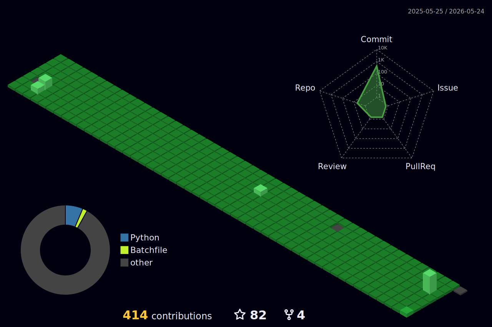

# LEE YOUNG JOON

 <!-- &include_all_commits=true -->
<!-- Rank
1 - 
[2*{1- 2^(-commits/250)} +
3*{1- 2^(-prs/50)} +
1*{1- 2^(-issues/25)} +
1*{1- 2^(-reviews/2)} +
4*{(stars/50)/ (1 + stars/50)} +
1*{(followers/10)/ (1 + followers/10)}] / 12
-->

<!--  -->

# 💪Skills
### Platforms & Languages

### Tools

# :mailbox_with_mail: Contacts

